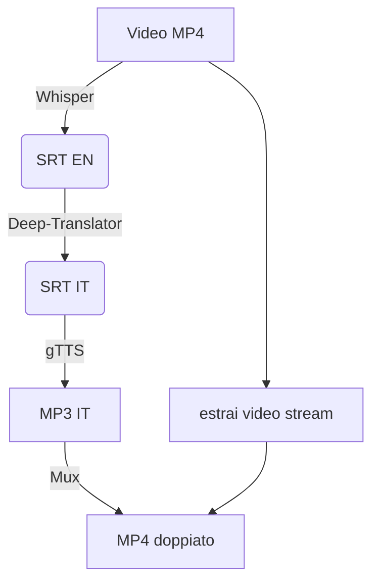

<p align="center">
  
  
  
  
</p>

# 🎬🔊 Doppiaggio Automatico in Italiano

> **Da MP4 a MP4 doppiato (e sottotitolato) in 4 semplici passi!**


## ✨ Funzionalità

1. **Trascrizione** — Estrae SRT (🇬🇧) dal video via OpenAI Whisper.
2. **Traduzione** — Converte i sottotitoli in 🇮🇹 con *deep-translator*.
3. **Sintesi vocale** — Genera MP3 italiano sincronizzato con i time-code.
4. **Mux finale** — Sostituisce la traccia audio del video con quella doppiata.

---

## 📑 Table of Contents

- [Requisiti](#requisiti)
- [Installazione rapida](#installazione-rapida)
- [Come funziona](#come-funziona)
- [Demo passo-passo](#demo-passo%E2%80%91passo)
- [Script](#script)
- [Tips & Tricks](#tips--tricks)

---

## 🔧 Requisiti

| Tool | Versione consigliata | Note |
|------|----------------------|------|
| Python | 3.9+ | |
| FFmpeg | qualsiasi | Deve essere nel `PATH` |
| PyTorch | >= 1.13 | Necessario per Whisper |

<details>
<summary><strong>Installa tutto in un colpo</strong></summary>

```bash
# crea venv (opzionale)
python -m venv .venv && source .venv/bin/activate  # Windows: .venv\Scripts\activate

# dipendenze
pip install whisper moviepy deep_translator gTTS pydub colorama
```

</details>

---

## ⚡ Installazione rapida

1. Copia `video.mp4` nella cartella di lavoro.
2. Lancia:

```bash
python srt.py video.mp4
```

Al termine troverai:

| File | Contenuto |
|------|-----------|
| `video.srt` | sottotitoli inglesi |
| `video_it.srt` | sottotitoli italiani |
| `video.mp3` | audio doppiato |
| `video_it.mp4` | video finale con nuovo audio |

---

## 🔍 Come funziona



---

## 🎮 Demo passo-passo

<details>
<summary>1️⃣ Estrazione SRT</summary>

```bash
🎞  Estraendo audio...
🤖 Caricando Whisper...
📝 Trascrivendo (può volerci un po' di tempo)...
💾 SRT salvato a video.srt
```

</details>

<details>
<summary>2️⃣ Traduzione & 3️⃣ Sintesi</summary>

```bash
⏳ Traducendo 171 righe...
✔ Traduzione completata → video_it.srt
⏳ Sintesi vocale in corso (171 segmenti)...
✔ MP3 generato: video.mp3
```

</details>

<details>
<summary>4️⃣ Mux finale</summary>

```bash
🔄 Caricamento video e nuovo audio…
💾 Esportazione video_it.mp4
✅ Completato!
```

</details>

---

## 🛠️ Script

| Nome | Descrizione rapida |
|------|--------------------|
| **`srt.py`** | L'orchestratore dei 4 step |  
| `traduttore.py` | Traduzione SRT con *deep-translator* |
| `sintetizzatore.py` | gTTS → MP3 sincronizzato |
| `sostituisci_audio.py` | Sostituisce l'audio in un MP4 |

---

## 💡 Tips & Tricks

* Vuoi più precisione? Cambia modello Whisper: `"small"`, `"medium"`, `"large"`.
* Hai una GPU? Installa PyTorch CUDA per un boost enorme.
* gTTS ha limiti di rate-limit: lo script divide frasi lunghe automaticamente.
* Puoi usare un TTS locale (e.g. Coqui, ElevenLabs) modificando `sintetizzatore.py`.

---

> *Buon doppiaggio!*  
> Condividi feedback e miglioramenti: **Pull Request** welcome! 🎥🎙️ 